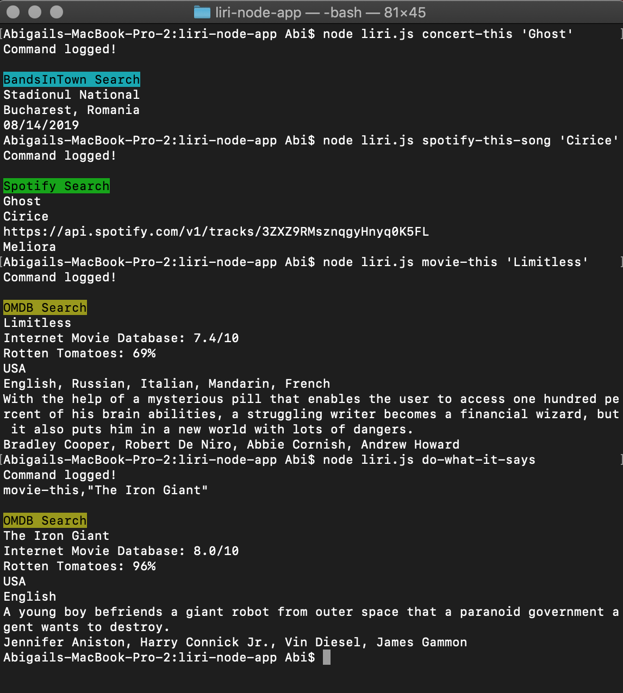

# LIRI Node App

Liri is a Node.js app that looks up information on songs, bands, and movies.

Commands:
* concert-this - looks up and displays an input artist's next concert
* spotify-this-song - looks up and displays spotify's data on the user input song
* movie-this - looks up and displays the data of the user input movie per OMDB's database
* do-what-it-says - reads local .txt file and runs the command specified in the file

System Requirements:
* GitBash or Terminal
* NodeJS
* npm

Instructions:
1. Open your terminal or gitbash and navigate to the direcotry containing the master branch
2. Run `npm install` - the package.json will assure that the required package components are installed
3. Type `node liri.js COMMAND 'INPUT'` into your terminal where `COMMAND` is one of the above listed commands and `INPUT` is your chosen artist, song or movie
4. Submit by pressing enter
5. Terminal will return a response accordingly